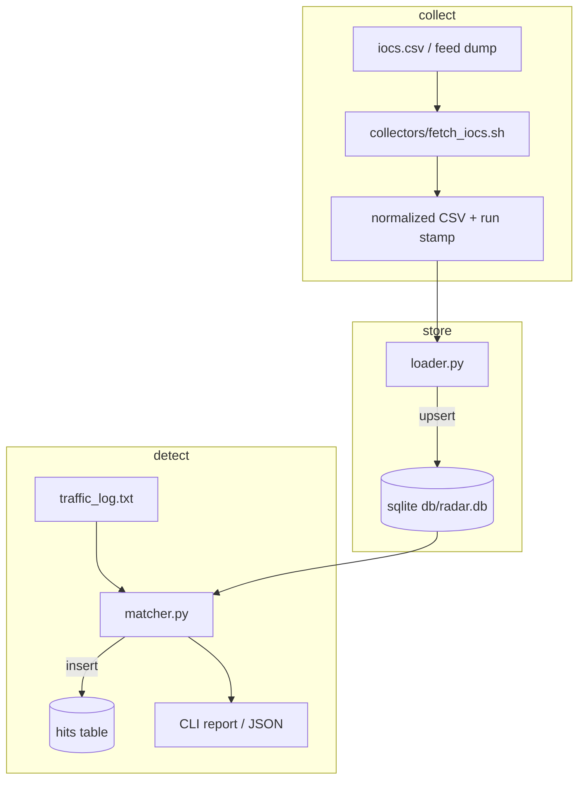

# threat-radar

Local threat-intel loop: take indicators in, store them, match them against a traffic-style log, keep hits in SQLite.

Bash handles the “collect / normalize a feed dump” part. Python handles load + match. I use this as a lab stand-in for the bigger platforms — same shape, fewer moving parts.

---

## Problem I was solving

Having IOCs in a spreadsheet is useless if you never check them against anything. I wanted:

1. a place indicators land (`iocs` table)  
2. a repeatable scan over logs  
3. a hit history I can query later  

without standing up Elastic or a cloud SIEM.

---

## IOC types

| type | example use |
|------|-------------|
| ip | bad C2 / brute sources |
| domain | phishing / malware DNS |
| url | full malicious links |
| hash | file indicators (demo field) |

CSV columns: `type,value,severity,source,tags`

Reloads upsert on `(type, value)` so you don't duplicate the same IP twenty times.

---

## Pipeline



Happy path command: `python3 engine/cli.py run` (load sample IOCs, scan sample log).

---

## Files

```
threat-radar/
  collectors/fetch_iocs.sh
  engine/
    store.py     # schema + helpers
    loader.py    # CSV → sqlite
    matcher.py   # line scan
    cli.py       # load | scan | run
  sample_data/
    iocs.csv
    traffic_log.txt
  db/            # created on first run
  tests/
```

Matching is deliberately simple (substring presence of the IOC value in the line). Good enough for demos and teaching the pipeline. Production would want token-aware IP/CIDR matching and proper URL parsing.

---

## How to build / run

```bash
git clone https://github.com/Nabil201-ctrl/threat-radar.git
cd threat-radar

chmod +x collectors/fetch_iocs.sh
./collectors/fetch_iocs.sh
```

One shot:

```bash
python3 engine/cli.py run
```

Step by step:

```bash
python3 engine/cli.py load -i sample_data/iocs.csv
python3 engine/cli.py scan -l sample_data/traffic_log.txt
python3 engine/cli.py scan --json
```

Peek at storage:

```bash
sqlite3 db/radar.db "SELECT type, value, severity FROM iocs;"
sqlite3 db/radar.db "SELECT ioc_value, severity, substr(log_line,1,80) FROM hits;"
```

Test:

```bash
python3 -c "
import sys
from pathlib import Path
sys.path.insert(0, str(Path('engine').resolve()))
sys.path.insert(0, str(Path('tests').resolve()))
from test_matcher import test_finds_bad_ip_and_domain
test_finds_bad_ip_and_domain()
print('ok')
"
```

---

## Build log (what I actually did)

1. Defined the schema first — if the tables felt wrong, the rest would be messy.  
2. Wrote loader + a couple of manual `sqlite3` checks.  
3. Wrote matcher against a tiny hand-made log that I knew contained hits.  
4. Added the shell collector last so re-runs leave a timestamped copy under `sample_data/runs/`.  
5. CLI subcommands (`load` / `scan` / `run`) once the pieces worked alone.

---

## Where this sits next to my other tools

Not a monorepo, but in my head:

- noisy IPs from auth work → drop into the IOC CSV here  
- domain/url hits → worth a closer look in a phishing scorer  
- host compromise signals → feed session / payment risk elsewhere  

Each repo stays usable on its own.

---

## Things left on the desk

- Pull a public feed inside `fetch_iocs.sh` instead of only local CSV  
- CIDR ranges  
- Map tags toward ATT&CK-style labels  
- Alert only on `severity=high`  
